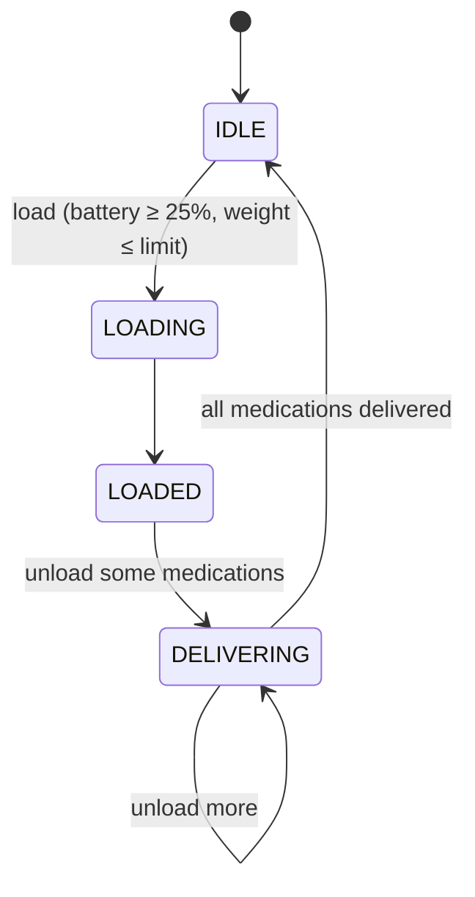

# Drone Service

[](https://github.com/jumba2010/drone-service/actions/workflows/ci.yml)


A **Spring Boot 3 REST service** that manages a fleet of delivery drones carrying medications.
It enforces the domain rules of a drone dispatch system - weight limits, battery safety thresholds and a
drone state machine - and runs a scheduled battery audit that keeps a historical log of every drone.

---

## Features

- **Drone registry** - register drones with serial number, model, weight limit (≤ 500 g) and battery capacity.
- **Loading / unloading workflow** with a guarded state machine (`IDLE → LOADING → LOADED → DELIVERING → IDLE`).
- **Business rule enforcement**
  - a drone can only be loaded while `IDLE`;
  - total medication weight must not exceed the drone's weight limit;
  - a drone cannot be loaded when its battery is **below 25%**;
  - all requested medications must exist (no partial loads).
- **Delivery records** - every unloaded medication produces a `Delivery` entry.
- **Periodic battery audit** - a `@Scheduled` job runs every 2 minutes, flags low-battery drones and writes a
  `DroneHistory` snapshot (battery level, battery state, drone state, timestamp) for auditing.
- **Consistent error contract** - a `@RestControllerAdvice` maps domain exceptions and Bean Validation failures to
  `400` / `404` JSON responses.
- **Transactional integrity** - load/unload run in a single transaction, so validation failures never leave partial state.

## Tech stack

| Concern | Technology |
|---------|------------|
| Language | Java 17 |
| Framework | Spring Boot 3 (Web, Data JPA, Validation, Scheduling) |
| Persistence | Hibernate 6, H2 in-memory database, SQL schema + seed data |
| Boilerplate | Lombok |
| Build | Gradle 7 (wrapper) |
| Testing | JUnit 5, Mockito, AssertJ, Spring Boot Test |
| Delivery | Multi-stage Dockerfile (non-root runtime), GitHub Actions CI |

## Architecture

```mermaid
flowchart LR
    Client([REST client]) --> Controller[DroneController<br/>/api/v1/drones]
    Controller --> Service[DroneService<br/>@Transactional]
    Service --> Validator[DroneValidator<br/>business rules]
    Service --> Repos[(Spring Data JPA<br/>repositories)]
    Scheduler[DroneBatteryServiceTask<br/>@Scheduled every 2 min] --> Repos
    Repos --> H2[(H2)]
    Controller -.errors.-> Advice[ExceptionControllerAdvice]
```

```
src/main/java/jumba/com/droneservice
├── controller   REST endpoints
├── services     application service, validation rules, scheduled battery audit
├── domain       JPA entities & enums (Drone, Medication, Delivery, DroneHistory, DroneState, BatteryState)
├── repository   Spring Data JPA repositories
├── request      request DTOs
├── exceptions   domain exceptions + error payload
└── aop          global exception handling
```

### Drone state machine



---

## API

Base path: `/api/v1/drones`

| Method | Endpoint | Description |
|--------|----------|-------------|
| `POST` | `/` | Register a drone |
| `GET` | `/available-for-loading` | List drones in `IDLE` state |
| `GET` | `/medications` | List all medications |
| `POST` | `/{serialNumber}/medications` | Load medications onto a drone |
| `GET` | `/{serialNumber}/medications` | Medications currently on board |
| `DELETE` | `/{serialNumber}/medications` | Unload (deliver) medications |

### Register a drone

```bash
curl -X POST http://localhost:8085/api/v1/drones \
  -H "Content-Type: application/json" \
  -d '{"serialNumber":"SN011","model":"LIGHTWEIGHT","weightLimit":300,"batteryCapacity":90}'
```

### Load a drone

```bash
curl -X POST http://localhost:8085/api/v1/drones/SN001/medications \
  -H "Content-Type: application/json" \
  -d '{"medicationIds":[1,2,3]}'
```

### Available drones - sample response

```json
[
  {
    "id": 100,
    "serialNumber": "SN001",
    "model": "LIGHTWEIGHT",
    "weightLimit": 300.0,
    "batteryCapacity": 100,
    "state": "IDLE",
    "loadedMedications": []
  }
]
```

### Error response

```json
{ "errorCode": 400, "message": "Drone cannot be loaded when battery level is below 25%" }
```

---

## Running

### With Docker

```bash
git clone https://github.com/jumba2010/drone-service.git
cd drone-service
docker build -t drone-service .
docker run -p 8085:8085 drone-service
```

### Locally (JDK 17)

```bash
./gradlew bootRun
```

The API is available at `http://localhost:8085`. The H2 database is seeded on startup with 10 drones and
50 medications (`src/main/resources/data.sql`).

### Tests

```bash
./gradlew test
```

Unit tests cover the loading/unloading rules (weight, battery, state, missing medications) and the
bidirectional drone ↔ medication association; a Spring context test verifies the application wiring.

---

## Possible next steps

- Replace H2 with PostgreSQL + Flyway migrations
- Add OpenAPI/Swagger documentation
- Optimistic locking (`@Version`) to protect against concurrent loads of the same drone
- Publish domain events (e.g. `DroneLoaded`, `MedicationDelivered`) to a message broker

## Author

**Judiao Mbaua** - Senior Backend / Java Software Engineer
[GitHub](https://github.com/jumba2010) · [LinkedIn](https://www.linkedin.com/in/judiao-mbaua-56b39946/)
